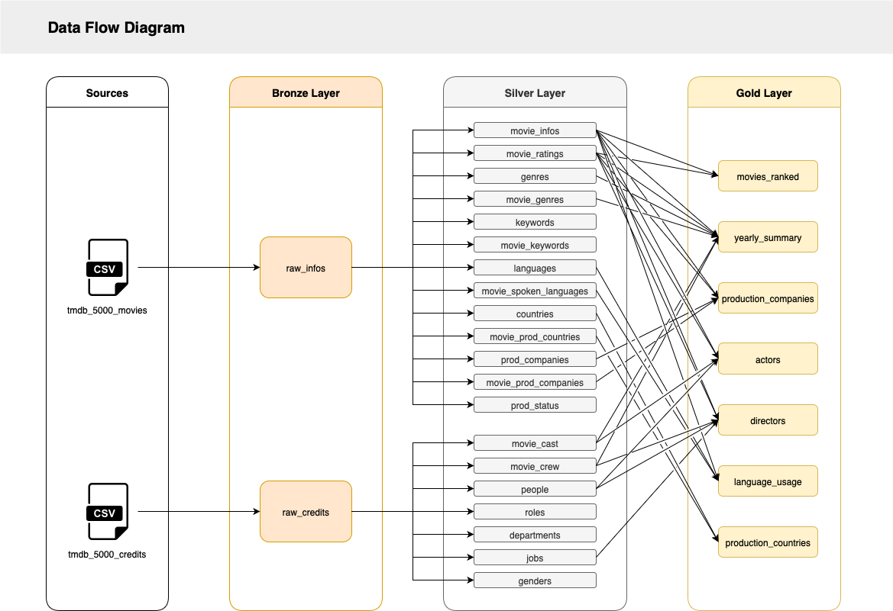
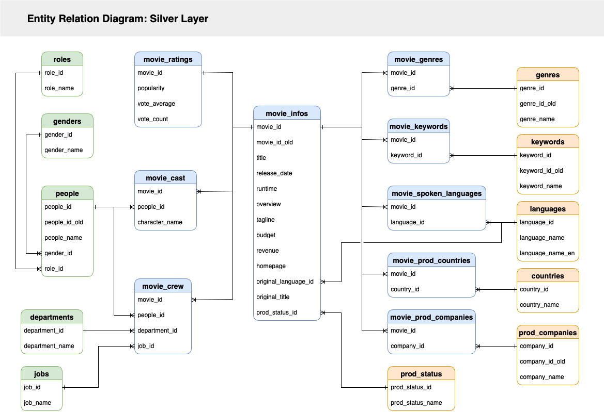

# SQL Movie Data Warehouse

Welcome to my movie data warehouse project! 👋

This project builds a movie data warehouse using MySQL based on data from The Movie Database (TMDb).

---

## 📖 Project Overview

abc

## 🏗️ Data Architecture

This project follows the [Medallion Architecture](https://dataengineering.wiki/Concepts/Data+Architecture/Medallion+Architecture), which organizes data by gradually improving its quality and accessability as it flows through three distinct layers:

1. **Bronze Layer**: Initial point of data ingestion from source systems into database. Stores raw unprocessed data.

2. **Silver Layer**: Creation of cleaned and normalized tables. Prepares standardized data for analysis.

3. **Gold Layer**: Creation of views that combine and aggregate data for business/analytics requirments.



The silver layer contains a total of twenty cleaned and normalized tables:




## 📂 Repository Structure
```
sql-movie-data-warehouse/
│
├── datasets/                           # Raw CSV files containing data used for the project
│   ├── tmdb_5000_credits.csv           # CSV file with movie cast and crew data
│   └── tmdb_5000_movies.csv            # CSV file with movie metadata
│
├── docs/                               # Project documentation and support files
│   ├── data_flow_diagram.html          # HTML file of diagram showing data flow through architecture layers
│   ├── data_flow_diagram.png           # PNG file of diagram showing data flow through architecture layers
│   ├── entity_relation_diagram.html    # HTML file of diagram showing network of silver layer tables
│   └── entity_relation_diagram.html    # PNG file of diagram showing network of silver layer tables
│
├── scripts/                            # SQL scripts for creating the data warehouse
│   ├── bronze_create_database.sql      # Script for creating database and reading raw CSV files
│   ├── silver_1_create_tables.sql      # Script for creating/extracting tables from raw data
│   ├── silver_2_clean_tables.sql       # Script for cleaning and normalizing tables
│   ├── silver_3_create_keys.sql        # Script for declaring primary and foreign keys
│   └── gold_create_views.sql           # Script for creating views based on clean tables
│
└── README.md                           # Project summary and instructions
```

